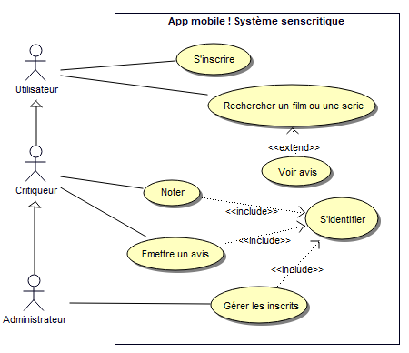

# Diagrammes de cas d'utilisation

## Je comprends (10 mn)

1. Quels sont les acteurs?
	- Customer, Administrator, bank

2. Quelles sont les relations entre les acteurs?
	- Relation d'héritage

3. A votre avis, la banque représente quel type d'acteur : acteur humain ou système externe?
	- Système externe

4. Est-ce à vous de mettre en oeuvre la banque? En quoi est-ce important pour vous (en tant qu'informaticien) de modéliser cet acteur?
	- Non ce n'est pas à nous de mettre en oeuvre la banque. C'est important car cela nous permet de visualiser les différentes personnes pouvant intéragir avec le système.

5. Quels sont les cas d'utilisation?
	- Withdraw, Transfer fund, Deposit money, Register ATM at bank, Read log.

6. Que peut faire un administrateur?
	- Un administrateur peut tout faire. Il peut faire les uc du customer + ceux qui lui son attribué.

7. Quels acteurs interviennent dans ces différents cas d'utilisation?
	- La bank, le customer et l'administrateur.

8. Que visualise le cadre autour des cas d'utilisation?
	- Le cadre autour des cas d'utilisations représentent les frontières du système.

9. Qu'exprime les cardinalités?
	- Les cardinalités représentent le nombre de fois q'un uc peut etre mis en place ou le nombre d'acteur. Par exemple un Customer peut faire 0 ou 1 retrait.

10. A quoi sert un diagramme de cas d'utilisation ?
	- Les diagrammes de cas d'utilisations sont utilisé pour donner une vision globale du comportement fonctionnel d'un système.

